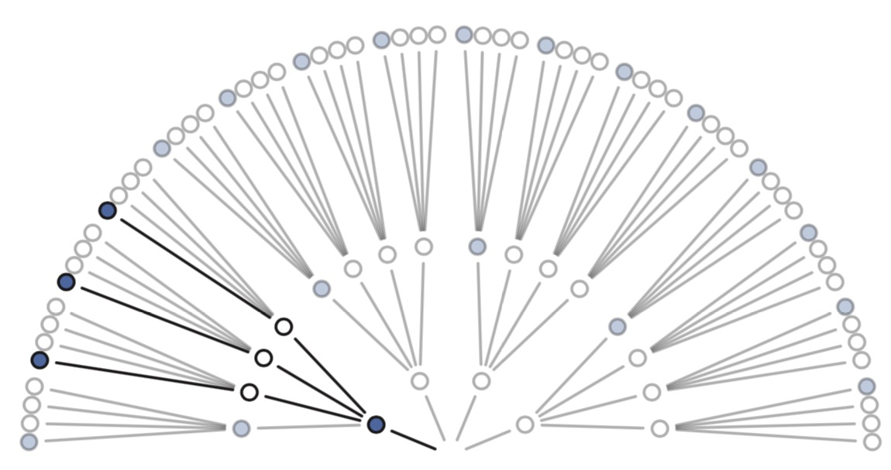
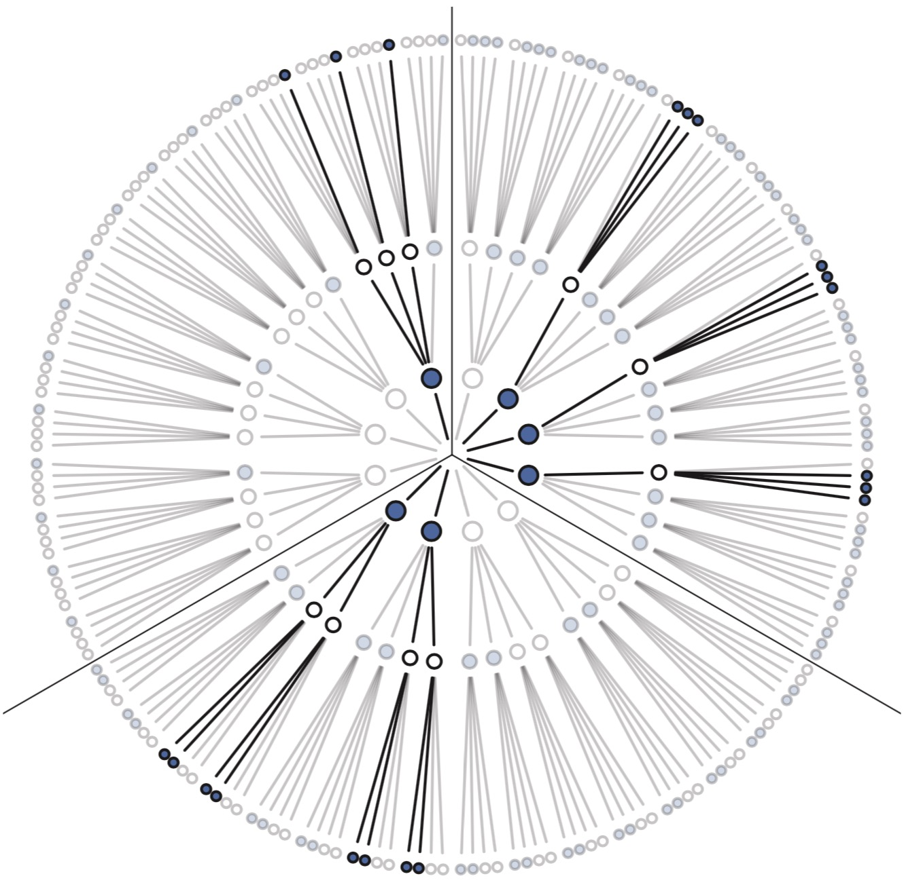

<!--
Our goal in this section will be to build Bayesian inference up from humble beginnings, so there is no superstition about it. Bayesian inference is really just counting and comparing of possibilities. Consider by analogy Jorge Luis Borges’ short story “The Garden of Forking Paths.” The story is about a man who encounters a book filled with contradictions. In most books, characters arrive at plot points and must decide among alternative paths. A protagonist may arrive at a man’s home. She might kill the man, or rather take a cup of tea. Only one of these paths is taken—murder or tea. But the book within Borges’ story explores all paths, with each decision branching outward into an expanding garden of forking paths.
-->

&emsp;&emsp;本节我们从头开始建立一个贝叶斯推断，没什么神秘的。贝叶斯推断本来就只是计数和比较可能性的大小。我们可以拿豪尔赫·路易斯·博尔赫斯的短篇小说“[小径分岔的花园](https://www.zhihu.com/question/20776234?sort=created)”做类比。故事讲述的是有个人拿到了一本充满矛盾的书。书中大部分内容是关于主人公到达某个岔路的时候必须选择其中一条路。他可能走到某人的家里，或者杀掉他或者只是一起喝杯茶。并且只能选择或者杀了他或者喝茶。博尔赫斯的故事中探讨了所有的路径，每一个决定都向外走到一个更大的花园。

<!--
This is the same device that Bayesian inference offers. In order to make good inference about what actually happened, it helps to consider everything that could have happened. A Bayesian analysis is a garden of forking data, in which alternative sequences of events are cultivated. As we learn about what did happen, some of these alternative sequences are pruned. In the end, what remains is only what is logically consistent with our knowledge.
-->

&emsp;&emsp;这与贝叶斯推断相同。了解了所有已经发生情况，才能做出正确的推断。贝叶斯分析就是这样一个充满了路径的花园，充满了需要做出选择的序列。如果我们知道了某些事件已经发生，那么就可以排除掉某些路径。最后剩下的就是根据已知情况能够推理出的路径。

<!--
This approach provides a quantitative ranking of hypotheses, a ranking that is maximally conservative, given the assumptions and data that go into it. The approach cannot guarantee a correct answer, on large world terms. But it can guarantee the best possible answer, on small world terms, that could be derived from the information fed into it.
-->

&emsp;&emsp;贝叶斯方法是对各种假设的一个定量排名，一个在给定数据和假设的情况下的极端保守排名。不保证在真实世界的应用中有正确答案。但是在小世界中贝叶斯方法可以保证这是从已知中能够得出的可能性最高的答案。
<!--
Consider the following toy example.
-->
&emsp;&emsp;看一个简单的例子

<!--
2.1.1. Counting possibilities. Suppose there’s a bag, and it contains four marbles. These marbles come in two colors: blue and white. We know there are four marbles in the bag, but we don’t know how many are of each color. We do know that there are five possibilities: (1)[ ],(2)[ ],(3)[ ],(4)[ ],(5)[ ]. Thesearetheonly possibilities consistent with what we know about the contents of the bag. Call these five possibilities the conjectures.
-->
&emsp;&emsp; **2.1.1 概率计数**。假设有一个袋子，里面有四个小球。小球有两种颜色：蓝色和白色。我们只知道袋子里有四个小球但是不知道蓝色和白色分别有多少个。那么就有5种可能：
（1）\[:white_circle::white_circle::white_circle::white_circle:\]，
（2）\[:large_blue_circle::white_circle::white_circle::white_circle:\]，
（3）\[:large_blue_circle::large_blue_circle::white_circle::white_circle:\]，
（4）\[:large_blue_circle::large_blue_circle::large_blue_circle::white_circle:\]，
（5）\[:large_blue_circle::large_blue_circle::large_blue_circle::large_blue_circle:\]。袋子里的小球的颜色只有这5种可能。这5个可能性我们叫它推测。

<!--
Our goal is to figure out which of these conjectures is most plausible, given some evi- dence about the contents of the bag. We do have some evidence: A sequence of three mar- bles is pulled from the bag, one at a time, replacing the marble each time and shaking the bag before drawing another marble. The sequence that emerges is: , in that order. These are the data.
-->
&emsp;&emsp; 我们的目标是在已知一些证据的情况下找出哪种组合的可能性最大。我们有一些已知证据：从袋子里随机取三次小球形成的一个数据序列，每次取之前都把已经取出的小球放回去并摇一摇袋子。结果是\(:large_blue_circle::white_circle::large_blue_circle:\)。这就是我们已知的数据。
<!--
So now let’s plant the garden and see how to use the data to infer what’s in the bag. Let’s begin by considering just the single conjecture, [ ], that the bag contains one blue and three white marbles. On the first draw from the bag, one of four things could happen, corre- sponding to one of four marbles in the bag. So we can visualize the possibilities branching outward:
-->
&emsp;&emsp; 我们来画一画这个“花园”，看一下怎么用这些数据来推断袋子里小球的颜色。我们随意选一种推测比如\[:large_blue_circle::white_circle::white_circle::white_circle:\]，袋子里有一个蓝球和三个白球。第一次从袋子取出小球的时候有4种可能。画出来的分支如下图所示：
<p align="center">  </p>

<!--
Now consider the garden as we get another draw from the bag. It expands the garden out one layer:
-->
现在选第二个球。“花园”展开的样子如下：

<p align="center">  </p>

<!--
Now there are 16 possible paths through the garden, one for each pair of draws. On the second draw from the bag, each of the paths above again forks into four possible paths. Why?
-->

现在花园有16条可能的路径，每条路径代表取一个小球。第二次取小球的时候，每条路径又扩展出4条新的路径。为什么？
<!--
Because we believe that our shaking of the bag gives each marble a fair chance at being drawn, regardless of which marble was drawn previously. The third layer is built in the same way, and the full garden is shown in Figure 2.2. There are 43 = 64 possible paths in total.
-->
因为每次取小球的时候我们都把以前取出的小球放进去并摇了袋子，取出没个小球的概率相同。第三层的构建也一样，整个花园如图2-2。有4的3次方=64条路径。

<p align="center">  </p>
<p align="center">图2-2 当袋子里有一个蓝球和三个白球时的64种可能</p>
<!--
As we consider each draw from the bag, some of these paths are logically eliminated. The first draw tuned out to be , recall, so the three white paths at the bottom of the garden are eliminated right away. If you imagine the real data tracing out a path through the garden, it must have passed through the one blue path near the origin. The second draw from the bag produces , so three of the paths forking out of the first blue marble remain. As the data trace out a path, we know it must have passed through one of those three white paths (after the first blue path), but we don’t know which one, because we recorded only the color of each marble. Finally, the third draw is . Each of the remaining three paths in the middle layer sustain one blue path, leaving a total of three ways for the sequence to appear, assuming the bag contains [ ]. Figure 2.3 shows the garden again, now with logically eliminated paths grayed out. We can’t be sure which of those three paths the actual data took. But as long as we’re considering only the possibility that the bag contains one blue and three white marbles, we can be sure that the data took one of those three paths. Those are the only paths consistent with both our knowledge of the bag’s contents (four marbles, white or blue) and the data ( ).
-->

&emsp;&emsp; 随着每次从袋子里取出小球，有些路径不合逻辑可以去掉。第一次取出的小球是:large_blue_circle:，所以全是白球的路径就可以去掉。真实的数据如果映射到花园路径上，那么它一定是穿过离起始点最近的那个蓝色小球。第二次取小球以后从第一个蓝球衍生出的三条路径保留了下来。我们的数据一定是一个蓝球后的三个白球的路径之一，但是并不知道到底是哪一条路径，因为每次只记录的小球的颜色。最后第三次取出的小球是:large_blue_circle:，每条前面剩下的路径只衍生出一条路径，所以最后有三条路径可以出现我们想要的序列:large_blue_circle::white_circle::large_blue_circle:，这里我们假设袋子里的小球是\[:large_blue_circle::white_circle::white_circle::white_circle:\]。图2-3把一些不可能的路径去掉又重新展示了一下可能的路径，现在我们无法确定到底走的是那条路径。但是因为我们只想知道袋子里有一个蓝球和三个白球的概率，所以可以肯定是其中一条路径。这三条路径就是我们根据已知（袋子里包含4个小球，白色或蓝色）和数据（:large_blue_circle::white_circle::large_blue_circle:）所能得出的结果。

<p align="center">  </p>
<p align="center">图2-3 把与数据冲突的路径取掉，只剩下3条可能的路径</p>

<!--
This demonstrates that there are three (out of 64) ways for a bag containing [ ] to produce the data . We have no way to decide among these three ways. The infer- ential power comes from comparing this count to the numbers of ways each of the other conjectures of the bag’s contents could produce the same data. For example, consider the conjecture [ ]. There are zero ways for this conjecture to produce the observed data, because even one is logically incompatible with it. The conjecture [ ] is likewise logically incompatible with the data. So we can eliminate these two conjectures, because neither provides even a single path that is consistent with the data.
-->

&emsp;&emsp;也就是说如果袋子里的小球是\[:large_blue_circle::white_circle::white_circle::white_circle:\]，那么有3(总共64)种方法得到数据:large_blue_circle::white_circle::large_blue_circle:。我们没法确定这三种方法中确切的一种。推断的强大之处在于可以对比袋子里小球每种可能的组合之间可以产生上述数据的可能的的多少。比如\[:white_circle::white_circle::white_circle::white_circle:\]可能的方法就是0。\[:large_blue_circle::large_blue_circle::large_blue_circle::large_blue_circle:\]可能的方法也是0。所以这两种组合我们可以排除了，因为没有一条路径可以产生我们已经观察到的数据。

<!--
Figure 2.4 displays the full garden now, for the remaining three conjectures: [ ], [ ], and [ ]. The upper-left wedge displays the same garden as Figure 2.3. The upper-right shows the analogous garden for the conjecture that the bag contains three blue marbles and one white marble. And the bottom wedge shows the garden for two blue and two white marbles. Now we count up all of the ways each conjecture could produce the observed data. For one blue and three white, there are three ways, as we counted already. For two blue and two white, there are eight paths forking through the garden that are logically consistent with the observed sequence. For three blue and one white, there are nine paths that survive.
-->

&emsp;&emsp;图2-4展示了完整的花园，包括\[:large_blue_circle::white_circle::white_circle::white_circle:\]，\[:large_blue_circle::large_blue_circle::white_circle::white_circle:\]和\[:large_blue_circle::large_blue_circle::large_blue_circle::white_circle:\]。图的左上角与图2-3相同。右上角展示的是当袋子里有三个蓝球和一个白球的样子。图的下半部分展示的是两个白球和两个蓝球时的样子。我们数一下每种组合产生观测数据的方法数。一个蓝球和三个白球的时候有三条路径。两个蓝球和两个白球的时候有八条路径产生我们的观测数据。三个蓝球和一个白球的时候有九条路径。

<p align="center">  </p>
<p align="center">图2-4 所有可能的组合可以产生已知数据的路径情况</p>

<!--
To summarize, we’ve considered five different conjectures about the contents of the bag, ranging from zero blue marbles to four blue marbles. For each of these conjectures, we’ve counted up how many sequences, paths through the garden of forking data, could potentially produce the observed data, :
-->

总结一下，我们把零个蓝球到四个蓝球的所有的组合情况都列出来。表中列出来所有可以产生观测数据的路径个数：

|   组合       |产生已知数据的路径数|
|-------------|-----------------|
|\[:white_circle::white_circle::white_circle::white_circle:\]|0 x 4 x 0 = 0|
|\[:large_blue_circle::white_circle::white_circle::white_circle:\]|1 x 3 x 1 = 3|
|\[:large_blue_circle::large_blue_circle::white_circle::white_circle:\]|2 x 2 x 2 = 8|
|\[:large_blue_circle::large_blue_circle::large_blue_circle::white_circle:\]|3 x 1 x 3 = 9|
|\[:large_blue_circle::large_blue_circle::large_blue_circle::large_blue_circle:\]|4 x 0 x 4 = 0|


<!--
Notice that the number of ways to produce the data, for each conjecture, can be computed by first counting the number of paths in each “ring” of the garden and then by multiplying these counts together. This is just a computational device. It tells us the same thing as Fig- ure 2.4, but without having to draw the garden. The fact that numbers are multiplied during calculation doesn’t change the fact that this is still just counting of logically possible paths. This point will come up again, when you meet the more formal representation of Bayesian inference.
-->
&emsp;&emsp;注意,每种组合产生观测数据的路径数量的就是数一下花园每个环上的路径数量，然后乘到一起就可以了。这就是个计算工具。结果跟图2-4一样，但却不用把整个花园都画出来。即使是乘法也改变不了我们只是数了数可能的路径的事实。后面讲贝叶斯推断更正式的表达时也是这样的。

<!--
So what good are these counts? By comparing these counts, we have part of a solution for a way to rate the relative plausibility of each conjectured bag composition. But it’s only a part of a solution, because in order to compare these counts we first have to decide how many ways each conjecture could itself be realized. We might argue that when we have no reason to assume otherwise, we can just consider each conjecture equally plausible and compare the counts directly. But often we do have reason to assume otherwise.
-->

&emsp;&emsp;这样的技术计算有什么好处呢？比较这些计数，起码我们有方法比较多种组合之间的可能性。但是这只能叫做一部分方法，因为必须得知道每种组合出现的概率大小。大家可能会说每种组合概率都相同直接比较数量就可以了。但是实际情况通常不是这样的。

<!--
Rethinking: Justification. Using these counts of paths through the garden as measures of relative plausibility can be justified in several ways. The justification here is logical: If we wish to reason about plausibility and remain consistent with ordinary logic—statements about true and false—then we should obey this procedure.39 There are several other justifications that lead to the same mathe- matical procedure. Regardless of how you choose to philosophically justify it, notice that it actually works. Justifications and philosophy motivate procedures, but it is the results that matter. The many successful real world applications of Bayesian inference may be all the justification you need. Twen- tieth century opponents of Bayesian data analysis argued that Bayesian inference was easy to justify, buthardtoapply.40 Thatisluckilynolongertrue.JustbecarefulnottoassumethatbecauseBayesian inference is justified that no other approach can also be justified. Golems come in many types, and some of all types are useful.
-->

>思考：证明。用类似这种花园路径的方式来度量可能性，有若干种证明方法。这里我们逻辑上证明一下：如果我们想要归因可能性并保留原来的逻辑，真假陈述，我们就能得到这个过程。还有好几种证明方法可以得到同样的数学过程。不管你怎么证明，总之它很有效。可能大家需要看到的证明方式是贝叶斯推断在真实世界中的成功应用。20世纪贝叶斯分析的反对者认为贝叶斯推断证明容易但是很难有实际应用。但是很幸运这不再是真的了，没有其他方法也可以证明它很有用，石人有很多种，有一些非常有用。


<!--
2.1.2. Using prior information. We may have prior information about the relative plausi- bility of each conjecture. This prior information could arise from knowledge of how the contents of the bag were generated. It could also arise from previous data. Or we might want to act as if we had prior information, so we can build conservatism into the analysis. Whatever the source, it would help to have a way to use prior information. Luckily there is a natural solution: Just multiply the prior count by the new count.
-->

**2.1.2 先验知识的应用**。我们可能掌握一些小球组合情况的先验信息。这个先验知识可能是关于小球组合是怎么生成的，也可能是从已知数据中推到出来的。为了展现我们对先验的认识，在分析的时候可以建立一些保留信息。不管来源怎样，总有一种方法把这些先验信息用起来。其实有个方法很简单，只要把先验和前面的数量相乘就可以了。
<!--
To grasp this solution, suppose we’re willing to say each conjecture is equally plausible at the start. So we just compare the counts of ways in which each conjecture is compatible with the observed data. This comparison suggests that [ ] is slightly more plausible than [ ], and both are about three times more plausible than [ ].
-->
&emsp;&emsp;为了展现算法，我们假设每种组合出现的概率相等。所以只需比较彼此出现观测数据的可能性就可以了。通过比较我们发现\[:large_blue_circle::large_blue_circle::large_blue_circle::white_circle:\]的可能性比\[:large_blue_circle::large_blue_circle::white_circle::white_circle:\]稍大，大约都是\[:large_blue_circle::white_circle::white_circle::white_circle:\]的三倍。

<!--
Now suppose we draw another marble from the bag to get another observation: . Now you have two choices. You could start all over again, making a garden with four layers to trace out the paths compatible with the data sequence . Or you could take the previous counts over conjectures (0, 3, 8, 9, 0) and just update them in light of the new observation. It turns out that these two methods are mathematically identical, as long as the new observation is logically independent of the previous observations.
-->

&emsp;&emsp;假设我们有又取了一次小球，有增加了一个观测数据：:large_blue_circle:。现在有两个选择：从头再来一遍，把花园图再画一遍。或者可以直接在(0, 3, 8, 9, 0)基础上继续。两种方法数学上是一样的，因为新的观测数据独立于前面的观测。
<!--
Here’s how to do it. First we count the numbers of ways each conjecture could produce the new observation, . Then we multiply each of these new counts by the previous numbers of ways for each conjecture. In table form:
-->
&emsp;&emsp;怎么做呢？首先数一下每种组合产生新观测数据的方法数。然后与之前的数量相乘。如下表：

|   组合       |取出蓝球的路径数|前述的路径数|新的路径数|
|-------------|-----------------|----------|--------------|
|\[:white_circle::white_circle::white_circle::white_circle:\]|0|0|0 x 0 = 0|
|\[:large_blue_circle::white_circle::white_circle::white_circle:\]|1|3|1 x 3  = 3|
|\[:large_blue_circle::large_blue_circle::white_circle::white_circle:\]|2|8|2 x 8 = 16|
|\[:large_blue_circle::large_blue_circle::large_blue_circle::white_circle:\]|3|9|3 x 9 = 27|
|\[:large_blue_circle::large_blue_circle::large_blue_circle::large_blue_circle:\]|4|0| 0 x 4 = 0|

<!--
The new counts in the right-hand column above summarize all the evidence for each conjec- ture. As new data arrive, and provided those data are independent of previous observations, then the number of logically possible ways for a conjecture to produce all the data up to that point can be computed just by multiplying the new count by the old count.
-->

&emsp;&emsp;最右面的一列是最终的数量。随着加入新的独立于之前观测的数据，计算新的结果只需要把每种组合产生新数据的可能数与之前的结果相乘。

<!--
This updating approach amounts to nothing more than asserting that (1) when we have previous information suggesting there are Wprior ways for a conjecture to produce a previous observation Dprior and (2) we acquire new observations Dnew that the same conjecture can produce in Wnew ways, then (3) the number of ways the conjecture can account for both Dprior as well as Dnew is just the product Wprior × Wnew. For example, in the table above the conjecture [ ] has Wprior = 8 ways to produce Dprior = . It also has Wnew = 2 ways to produce the new observation Dnew = . So there are 8 × 2 = 16 ways for the conjecture to produce both Dprior and Dnew. Why multiply? Multiplication is just a shortcut to enumerating and counting up all of the paths through the garden that could produce all the observations.
-->
&emsp;&emsp;这种更新策略只需保证：（1）已知数据产生观测数据D<sub>prior</sub> 有W<sub>prior</sub>条路径，（2）从同样的组合产生新的观测数据 D<sub>new</sub>的路径有W<sub>new</sub>条，（3）那么从组合中产生数据D<sub>prior</sub> 和 D<sub>new</sub> 就是 W<sub>prior</sub> × W<sub>new</sub>。 例如上表中对于组合\[:large_blue_circle::large_blue_circle::white_circle::white_circle:\]，对于数据D<sub>prior</sub>，W<sub>prior</sub> = 8。对于D<sub>new</sub>=:large_blue_circle:，W<sub>new</sub> = 2。所以就有  8 × 2 = 16条路径产生D<sub>prior</sub>和D<sub>new</sub>。至于为什么是乘法，因为乘是花园路径数排列的简单计算方法。


<!--
In this example, the prior data and new data are of the same type: marbles drawn from the bag. But in general, the prior data and new data can be of different types. Suppose for example that someone from the marble factory tells you that blue marbles are rare. So for every bag containing [ ], they made two bags containing [ ] and three bags containing [ ]. They also ensured that every bag contained at least one blue and one white marble. We can update our counts again:
-->
&emsp;&emsp;上面的例子里，先验数据和新数据类型是一样的：都是从袋子里取小球。但是通常情况下，先验数据和新数据可能是不同类型的。比如小球工厂的工人告诉你，蓝球很少。比如每生产一组\[:large_blue_circle::large_blue_circle::large_blue_circle::white_circle:\]，就生产两组\[:large_blue_circle::large_blue_circle::white_circle::white_circle:\]，然后生产三组\[:large_blue_circle::white_circle::white_circle::white_circle:\]。而且他们还确定每个袋子里至少有一个蓝球和一个白球。这时我们的计数就可以这样更新：

|   组合       |前述路径数|工厂数据|新的路径数|
|-------------|-----------------|----------|--------------|
|\[:white_circle::white_circle::white_circle::white_circle:\]|0|0|0 x 0 = 0|
|\[:large_blue_circle::white_circle::white_circle::white_circle:\]|3|3|3 x 3  = 3|
|\[:large_blue_circle::large_blue_circle::white_circle::white_circle:\]|16|2|16 x 2 = 32|
|\[:large_blue_circle::large_blue_circle::large_blue_circle::white_circle:\]|27|1|27 x 1 = 27|
|\[:large_blue_circle::large_blue_circle::large_blue_circle::large_blue_circle:\]|0|0| 0 x 0 = 0|

<!--
Now the conjecture [
threshold difference in these counts at which we can safely decide that one of the conjectures is the correct one? You’ll spend the next chapter exploring that question.
-->

&emsp;&emsp;现在\[:large_blue_circle::large_blue_circle::white_circle::white_circle:\]的可能性最大，但是只比\[:large_blue_circle::large_blue_circle::large_blue_circle::white_circle:\]多一点点。那么有没有一个阈值，当超过这个阈值，我们就可以肯定的说是这个组合而不是另一个。后面的章节我们会学习到。
<!--
Rethinking: Original ignorance. Which assumption should we use, when there is no previous infor- mation about the conjectures? The most common solution is to assign an equal number of ways that each conjecture could be correct, before seeing any data. This is sometimes known as the principle of indifference: When there is no reason to say that one conjecture is more plausible than another, weigh all of the conjectures equally. The issue of choosing a representation of “ignorance” is surpris- ingly complicated. The issue will arise again in later chapters. For the sort of problems we examine in this book, the principle of indifference results in inferences very comparable to mainstream non- Bayesian approaches, most of which contain implicit equal weighting of possibilities. For example a typical non-Bayesian confidence interval weighs equally all of the possible values a parameter could take, regardless of how implausible some of them are. Many non-Bayesian procedures have moved away from this, through the use of penalized likelihood and other methods. We’ll discuss these in Chapter 6.
-->
>思考：刚开始忽略的。当没有任何先验的时候哪些假设我们可以用？通常的做法是在看到任何数据之前每种组合分配一个相等的概率。这有时候就作为一个不成文的规则：当没有充分的理由说某个组合比其他组合的可能性大，那么就假设所有的组合的可能性相同。选择忽略什么是个非常复杂的问题。后面的章节这个问题还会更复杂。本书研究的问题中大多数都假设有等权重的概率，与非贝叶斯推断基本类似。比如典型的非贝叶斯置信区间就等权重的衡量了所有可能的参数，。很多非贝叶斯通过惩罚似然脱离了这一点。第六章会讨论到。

<!--
2.1.3. From counts to probability. It is helpful to think of this strategy as adhering to a principle of honest ignorance: When we don’t know what caused the data, potential causes that may produce the data in more ways are more plausible. This leads us to count paths through the garden of forking data.
-->
**2.1.3 从数量到概率**。反正搞不清楚状况的时候就坚持一个原则准没错：当我们不知道产生某个数据的确切原因的时候，潜在的能够以更多种方式产生的这个数据的因素的可能性更大。所以我们数花园路径的数量。

<!--
It’s hard to use these counts though, so we almost always standardize them in a way that transforms them into probabilities. Why is it hard to work with the counts? First, since relative value is all that matters, the size of the counts 3, 8, and 9 contain no information of value. They could just as easily be 30, 80, and 90. The meaning would be the same. It’s just the relative values that matter. Second, as the amount of data grows, the counts will very quickly grow very large and become difficult to manipulate. By the time we have 10 data points, there are already more than one million possible sequences. We’ll want to analyze data sets with thousands of observations, so explicitly counting these things isn’t practical.
-->
&emsp;&emsp;直接的数量用起来很不方便，所以通常都标准化成概率值。为什么？首先我们只需要关注数量的相对大小，所以数量是3、8、9还是30、80、90，含义是相同的。真正有意义的是它们之间的大小。其次，随着数据的增长数量增涨的非常快，上面小球的例子中如果有10个数据点，路径数就已经超过百万了，实际应用中随随便便就有几千条数据，所以计数在实际应用中没法处理。

<!--
Luckily, there’s a mathematical way to compress all of this. Specifically, we define the updated plausibility of each possible composition of the bag, after seeing the data, as:
-->
&emsp;&emsp;幸运的是，有一些数学方法可以简化。当得到一个新的数据的时候我们可以这样更新每种组合的概率值：

<p align='center'>看到数据(:large_blue_circle::white_circle::large_blue_circle:)推测出组合[:large_blue_circle::white_circle::white_circle::white_circle:]的可能性</p>
<p align='center'>∝</p>
<p align='center'>[:large_blue_circle::white_circle::white_circle::white_circle:]能够产生(:large_blue_circle::white_circle::large_blue_circle:)的路径数</p>
<p align='center'>x</p>
<p align='center'>[:large_blue_circle::white_circle::white_circle::white_circle:]的先验概率</p>


<!--
That little ∝ means proportional to. We want to compare the plausibility of each possible bag composition. So it’ll be helpful to define p as the proportion of marbles that are blue. For [
],p = 1/4 = 0.25. AlsoletDnew = . Andnowwecanwrite:
-->
∝ 的意思是正比于。目标是比较每种组合的可能性。我们定义p为每种组合中蓝色小球的比例。对于组合\[:large_blue_circle::white_circle::white_circle::white_circle:\]，p=1/4=0.25。同样设D<sub>new</sub>=（[:large_blue_circle::white_circle::large_blue_circle:]），那么就有：


<p align="center">  </p>


<!--
The above just means that for any value p can take, we judge the plausibility of that value p as proportional to the number of ways it can get through the garden of forking data. This expression just summarizes the calculations you did in the tables of the previous section.
-->

上面的公式表示p取每个值的概率正比于花园中路径的数量，只是对前一节中的计算表格做了一个更加形式化的表示。

<!--
Finally, we construct probabilities by standardizing the plausibility so that the sum of the plausibilities for all possible conjectures will be one. All you need to do in order to stan- dardize is to add up all of the products, one for each value p can take, and then divide each product by the sum of products:
-->
最后想得到每种组合的概率值，只需要把p的每个取值的数量除以路径的总数就可以标准化成概率值。
<!--
A worked example is needed for this to really make sense. So consider again the table from before, now updated using our definitions of p and “plausibility”:
-->

为了加深印象举例如下。用p和概率值替换原来的表格即可：

|   组合       |p|路径数|概率|
|-------------|-----------------|----------|--------------|
|\[:white_circle::white_circle::white_circle::white_circle:\]|0|0| 0|
|\[:large_blue_circle::white_circle::white_circle::white_circle:\]|0.25|3|0.15|
|\[:large_blue_circle::large_blue_circle::white_circle::white_circle:\]|0.5|8|0.40|
|\[:large_blue_circle::large_blue_circle::large_blue_circle::white_circle:\]|0.75|9|0.45|
|\[:large_blue_circle::large_blue_circle::large_blue_circle::large_blue_circle:\]|1|0|0|


<!--
You can quickly compute these plausibilities in R:
-->
用R计算很简单

```
ways <- c( 0 , 3 , 8 , 9 , 0 )
ways/sum(ways)
```
```console
[1] 0.00 0.15 0.40 0.45 0.00
```

<!--
The values in ways are the products mentioned before. And sum(ways) is the denominator “sum of products” in the expression near the top of the page.
-->

ways是前面提到的乘积。sum(ways) 是前面公式中的分母部分。

<!--
These plausibilities are also probabilities—they are non-negative (zero or positive) real numbers that sum to one. And all of the mathematical things you can do with probabilities you can also do with these values. Specifically, each piece of the calculation has a direct partner in applied probability theory. These partners have stereotyped names, so it’s worth learning them, as you’ll see them again and again.
-->

这些可能性也是概率，和为1的非负（0或正数）实数。所有概率相关的计算都可以应用。而且公式的每一部分在传统概率论中都有对应的正式名称。因为需要反复的用到，我们来简单过一下：
<!--
A conjectured proportion of blue marbles, p, is usually called a parameter value. It’s just a way of indexing possible explanations of the data.
The relative number of ways that a value p can produce the data is usually called a likelihood. It is derived by enumerating all the possible data sequences that could have happened and then eliminating those sequences inconsistent with the data.
The prior plausibility of any specific p is usually called the prior probability.
The new, updated plausibility of any specific p is usually called the posterior
probability.
-->

- 蓝色小球的比例p，通常叫做参数。它只是数据的可能解释的一个标记。
- p产生数据的相对路径数量通常叫做似然。它是枚举所有可能产生观测数据的路径并把一些不可能的情况取掉。
- p的已知情况通常叫做先验概率。
- 每个p的概率更新后的概率叫做后验概率

<!--
In the next major section, you’ll meet the more formal notation for these objects and see how they compose a simple statistical model.
-->
下一节我们用更加形式化的表达式来看一下这些概念并建立一个简单的统计模型。
<!--
Rethinking: Randomization. When you shuffle a deck of cards or assign subjects to treatments by flipping a coin, it is common to say that the resulting deck and treatment assignments are randomized. What does it mean to randomize something? It just means that we have processed the thing so that we know almost nothing about its arrangement. Shuffling a deck of cards changes our state of knowledge, so that we no longer have any specific information about the ordering of cards. However, the bonus that arises from this is that, if we really have shuffled enough to erase any prior knowledge of the ordering, then the order the cards end up in is very likely to be one of the many orderings with high information entropy. The concept of information entropy will be increasingly important as we progress, and will be unpacked in Chapters 6 and 9.
-->
>思考：随机。当我们洗牌或者通过抛硬币来分配受试者的时候，我们常说牌或者实验分配是随机的。把一个事物随机化意味着什么？意味着我们处理数据的时候对于安排一无所知。通过洗牌我们就不知道牌的顺序。好处是通过洗牌抹去任何关于顺序的先验知识会使牌的顺序非常接近那些高信息熵的顺序组合。信息熵这个概念在后面会越来越重要，第6章和第9章会详细介绍。

