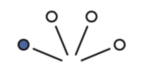
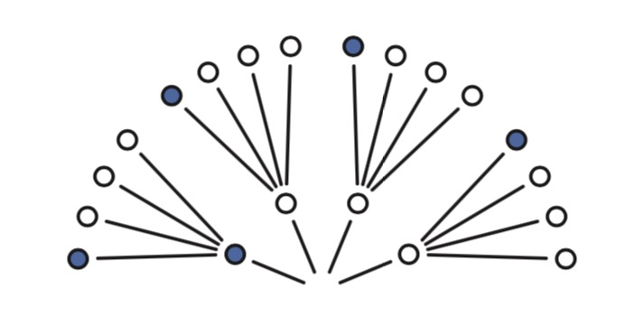
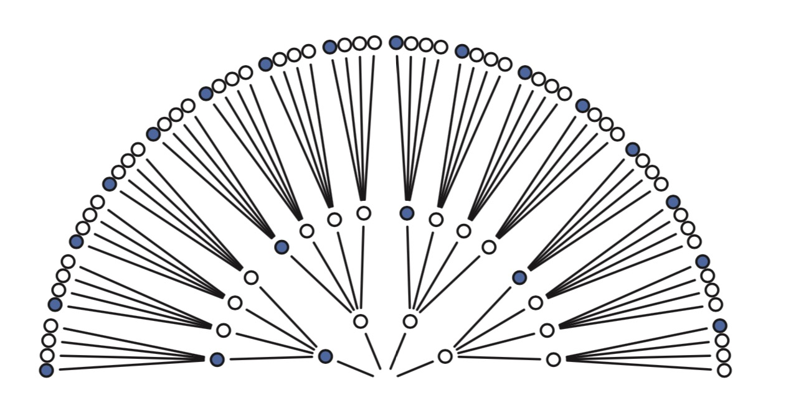

<!--
Our goal in this section will be to build Bayesian inference up from humble beginnings, so there is no superstition about it. Bayesian inference is really just counting and comparing of possibilities. Consider by analogy Jorge Luis Borges’ short story “The Garden of Forking Paths.” The story is about a man who encounters a book filled with contradictions. In most books, characters arrive at plot points and must decide among alternative paths. A protagonist may arrive at a man’s home. She might kill the man, or rather take a cup of tea. Only one of these paths is taken—murder or tea. But the book within Borges’ story explores all paths, with each decision branching outward into an expanding garden of forking paths.
-->

&emsp;&emsp;本节我们从头开始建立一个贝叶斯推断，没什么神秘的。贝叶斯推断本来就只是计数和比较可能性的大小。我们可以拿豪尔赫·路易斯·博尔赫斯的短篇小说“[小径分岔的花园](https://www.zhihu.com/question/20776234?sort=created)”做类比。故事讲述的是有个人拿到了一本充满矛盾的书。书中大部分内容是关于主人公到达某个岔路的时候必须选择其中一条路。他可能走到某人的家里，或者杀掉他或者只是一起喝杯茶。并且只能选择或者杀了他或者喝茶。博尔赫斯的故事中探讨了所有的路径，每一个决定都向外走到一个更大的花园。

<!--
This is the same device that Bayesian inference offers. In order to make good inference about what actually happened, it helps to consider everything that could have happened. A Bayesian analysis is a garden of forking data, in which alternative sequences of events are cultivated. As we learn about what did happen, some of these alternative sequences are pruned. In the end, what remains is only what is logically consistent with our knowledge.
-->

&emsp;&emsp;这与贝叶斯推断相同。了解了所有已经发生情况，才能做出正确的推断。贝叶斯分析就是这样一个充满了路径的花园，充满了需要做出选择的序列。如果我们知道了某些事件已经发生，那么就可以排除掉某些路径。最后剩下的就是根据已知情况能够推理出的路径。

<!--
This approach provides a quantitative ranking of hypotheses, a ranking that is maximally conservative, given the assumptions and data that go into it. The approach cannot guarantee a correct answer, on large world terms. But it can guarantee the best possible answer, on small world terms, that could be derived from the information fed into it.
-->

&emsp;&emsp;贝叶斯方法是对各种假设的一个定量排名，一个在给定数据和假设的情况下的极端保守排名。不保证在真实世界的应用中有正确答案。但是在小世界中贝叶斯方法可以保证这是从已知中能够得出的可能性最高的答案。
<!--
Consider the following toy example.
-->
&emsp;&emsp;看一个简单的例子

<!--
2.1.1. Counting possibilities. Suppose there’s a bag, and it contains four marbles. These marbles come in two colors: blue and white. We know there are four marbles in the bag, but we don’t know how many are of each color. We do know that there are five possibilities: (1)[ ],(2)[ ],(3)[ ],(4)[ ],(5)[ ]. Thesearetheonly possibilities consistent with what we know about the contents of the bag. Call these five possibilities the conjectures.
-->
&emsp;&emsp; **2.1.1 概率计数**。假设有一个袋子，里面有四个小球。小球有两种颜色：蓝色和白色。我们只知道袋子里有四个小球但是不知道蓝色和白色分别有多少个。那么就有5种可能：
（1）\[:white_circle::white_circle::white_circle::white_circle:\]，
（2）\[:large_blue_circle::white_circle::white_circle::white_circle:\]，
（3）\[:large_blue_circle::large_blue_circle::white_circle::white_circle:\]，
（4）\[:large_blue_circle::large_blue_circle::large_blue_circle::white_circle:\]，
（5）\[:large_blue_circle::large_blue_circle::large_blue_circle::large_blue_circle:\]。袋子里的小球的颜色只有这5种可能。这5个可能性我们叫它推测。

<!--
Our goal is to figure out which of these conjectures is most plausible, given some evi- dence about the contents of the bag. We do have some evidence: A sequence of three mar- bles is pulled from the bag, one at a time, replacing the marble each time and shaking the bag before drawing another marble. The sequence that emerges is: , in that order. These are the data.
-->
&emsp;&emsp; 我们的目标是在已知一些证据的情况下找出哪种组合的可能性最大。我们有一些已知证据：从袋子里随机取三次小球形成的一个数据序列，每次取之前都把已经取出的小球放回去并摇一摇袋子。结果是\(:large_blue_circle::white_circle::large_blue_circle:\)。这就是我们已知的数据。
<!--
So now let’s plant the garden and see how to use the data to infer what’s in the bag. Let’s begin by considering just the single conjecture, [ ], that the bag contains one blue and three white marbles. On the first draw from the bag, one of four things could happen, corre- sponding to one of four marbles in the bag. So we can visualize the possibilities branching outward:
-->
&emsp;&emsp; 我们来画一画这个“花园”，看一下怎么用这些数据来推断袋子里小球的颜色。我们随意选一种推测比如\[:large_blue_circle::white_circle::white_circle::white_circle:\]，袋子里有一个蓝球和三个白球。第一次从袋子取出小球的时候有4种可能。画出来的分支如下图所示：

  

<!--
Now consider the garden as we get another draw from the bag. It expands the garden out one layer:
-->
现在选第二个球。“花园”展开的样子如下：

  

<!--
Now there are 16 possible paths through the garden, one for each pair of draws. On the second draw from the bag, each of the paths above again forks into four possible paths. Why?
-->

现在花园有16条可能的路径，每条路径代表取一个小球。第二次取小球的时候，每条路径又扩展出4条新的路径。为什么？
<!--
Because we believe that our shaking of the bag gives each marble a fair chance at being drawn, regardless of which marble was drawn previously. The third layer is built in the same way, and the full garden is shown in Figure 2.2. There are 43 = 64 possible paths in total.
-->
因为每次取小球的时候我们都把以前取出的小球放进去并摇了袋子，取出没个小球的概率相同。第三层的构建也一样，整个花园如图2-2。有4的3次方=64条路径。

  

图2-2 当袋子里有一个蓝球和三个白球时的64种可能

<!--
As we consider each draw from the bag, some of these paths are logically eliminated. The first draw tuned out to be , recall, so the three white paths at the bottom of the garden are eliminated right away. If you imagine the real data tracing out a path through the garden, it must have passed through the one blue path near the origin. The second draw from the bag produces , so three of the paths forking out of the first blue marble remain. As the data trace out a path, we know it must have passed through one of those three white paths (after the first blue path), but we don’t know which one, because we recorded only the color of each marble. Finally, the third draw is . Each of the remaining three paths in the middle layer sustain one blue path, leaving a total of three ways for the sequence to appear, assuming the bag contains [ ]. Figure 2.3 shows the garden again, now with logically eliminated paths grayed out. We can’t be sure which of those three paths the actual data took. But as long as we’re considering only the possibility that the bag contains one blue and three white marbles, we can be sure that the data took one of those three paths. Those are the only paths consistent with both our knowledge of the bag’s contents (four marbles, white or blue) and the data ( ).
-->

&emsp;&emsp; 随着每次从袋子里取出小球，有些路径不合逻辑可以去掉。第一次取出的小球是:large_blue_circle:，所以全是白球的路径就可以去掉。真实的数据如果映射到花园路径上，那么它一定是穿过离起始点最近的那个蓝色小球。第二次取小球以后从第一个蓝球衍生出的三条路径保留了下来。我们的数据一定是一个蓝球后的三个白球的路径之一，但是并不知道到底是哪一条路径，因为每次只记录的小球的颜色。最后第三次取出的小球是:large_blue_circle:，每条前面剩下的路径只衍生出一条路径，所以最后有三条路径可以出现我们想要的序列:large_blue_circle::white_circle::large_blue_circle:，这里我们假设袋子里的小球是\[:large_blue_circle::white_circle::white_circle::white_circle:\]。图2-3把一些不可能的路径去掉又重新展示了一下可能的路径，现在我们无法确定到底走的是那条路径。但是因为我们只想知道袋子里有一个蓝球和三个白球的概率，所以可以肯定是其中一条路径。这三条路径就是我们根据已知（袋子里包含4个小球，白色或蓝色）和数据（:large_blue_circle::white_circle::large_blue_circle:）所能得出的结果。
