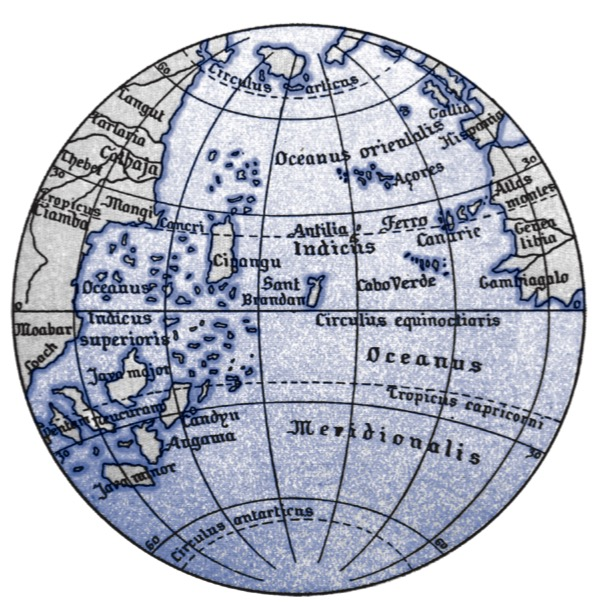

# 小世界和大世界

<!--
When Cristoforo Colombo (Christopher Columbus) infamously sailed west in the year 1492, he believed that the Earth was spherical. In this, he was like most educated people of his day. He was unlike most people, though, in that he also believed the planet was much smaller than it actually is—only 30,000 km around its middle instead of the actual 40,000 km (Figure 2.1).35 This was one of the most consequential mistakes in European history. If Colombo had believed instead that the Earth was 40,000 km around, he would have correctly reasoned that his fleet could not carry enough food and potable water to complete a journey all the way westward to Asia. But at 30,000 km around, Asia would lie a bit west of the coast of California. It was possible to carry enough supplies to make it that far. Emboldened in part by his unconventional estimate, Colombo set sail, eventually making landfall in the Bahamas.
-->
&emsp;&emsp;1492年当哥伦布开始他那臭名昭著的航海的时候，他就相信地球是圆的。这一点上跟那个时候受过教育的人的认知是相同的。但是跟其他人不同的是，他认为地球要小的多，直径大约3万公里而不是实际上的4万公里（图2-1）。这是欧洲历史上很重要的错误之一。如果哥伦布相信地球直径是4万公里，他肯定能推算出船队不可能携带足够的食物和淡水到达亚洲。但如果是3万的话，亚洲就位于加利福尼亚海岸西边一点点。这样得出的结论就是可以到达的。基于这样乐观的估计，哥伦布才开始航海，最终在巴哈马登陆。

  

*马丁·贝海姆绘制的哥伦布使用的1492年的世界地图，欧洲在右边，亚洲在左边，那个写着Cipangu的岛是日本*

<!--
Colombo made a prediction based upon his view that the world was small. But since he lived in a large world, aspects of the prediction were wrong. In his case, the error was lucky. His small world model was wrong in an unanticipated way: There was a lot of land in the way. If he had been wrong in the expected way, with nothing but ocean between Europe and Asia, he and his entire expedition would have run out of supplies long before reaching the East Indies.
-->
&emsp;&emsp;哥伦布基于地球很小的假设做出了预测。但是实际地球很大，所以各种预测都是错的。哥伦布很幸运，沿途有很多陆地。但如果不幸，欧洲和亚洲之间没陆地，哥伦布的探险队在到达东印度群岛之前补给早就耗光了。

<!--
Colombo’s small and large worlds provide a contrast between model and reality. All statistical modeling has these same two frames: the small world of the model itself and the large world we hope to deploy the model in.36 Navigating between these two worlds remains a central challenge of statistical modeling. The challenge is aggravated by forgetting the dis- tinction.
-->
&emsp;&emsp;哥伦布的小世界和大世界跟统计建模和现实应用之间的关系很类似。所有的统计模型都是在一个小世界建立的，但是真实应用却是在大世界中。在两个世界之间转换仍然是统计建模的核心问题。时刻都得主意。

<!--
The small world is the self-contained logical world of the model. Within the small world, all possibilities are nominated. There are no pure surprises, like the existence of a huge continent between Europe and Asia. Within the small world of the model, it is important to be able to verify the model’s logic, making sure that it performs as expected under favorable assumptions. Bayesian models have some advantages in this regard, as they have reasonable claims to optimality: No alternative model could make better use of the information in the data and support better decisions, assuming the small world is an accurate description of the real world.37
-->
&emsp;&emsp;小世界对应模型的逻辑世界。在小世界中所有的情况都能考虑到，没有什么意外情况，就像我们已经明确知道欧洲亚洲之间还有大陆存在。在小世界中最重要的事情是验证模型的逻辑按照我们预想的在运转。贝叶斯模型因为对优化有比较合理的要求，所以在这一点上有优势：如果假设小世界是对现实世界的精确描述，那么没有比贝叶斯模型能更好的应用这些数据做作决策的模型了。

<!--
The large world is the broader context in which one deploys a model. In the large world, there may be events that were not imagined in the small world. Moreover, the model is always an incomplete representation of the large world, and so will make mistakes, even if all kinds of events have been properly nominated. The logical consistency of a model in the small world is no guarantee that it will be optimal in the large world. But it is certainly a warm comfort.
-->
&emsp;&emsp;现实世界才是模型部署的环境。在现实世界中会有意想不到的情况发生。而且模型通常表示的是现实世界的一部分，所以即使所有的情况都考虑到也可能出错。小世界的逻辑一致在现实世界中不一定是最优的。只是个心理安慰罢了。

<!--
In this chapter, you will begin to build Bayesian models. The way that Bayesian models learn from evidence is arguably optimal in the small world. When their assumptions approx- imate reality, they also perform well in the large world. But large world performance has to be demonstrated rather than logically deduced. Passing back and forth between these two worlds allows both formal methods, like Bayesian inference, and informal methods, like peer review, to play an indispensable role.
-->
&emsp;&emsp;本章我们开始构建贝叶斯模型。贝叶斯模型从证据中学习的构建过程在小世界中可以说是最优方式。如果假设与现实世界比较接近，贝叶斯模型在现实世界中也会表现良好。但是必须在现实世界中证明，不能只靠逻辑推断。两个世界穿插会用到很多形式化方法（比如贝叶斯推断）和非形式化方法（比如同行的评审），都很重要。

<!--
This chapter focuses on the small world. It explains probability theory in its essential form: counting the ways things can happen. Bayesian inference arises automatically from this perspective. Then the chapter presents the stylized components of a Bayesian statistical model, a model for learning from data. Then it shows you how to animate the model, to produce estimates.
-->
&emsp;&emsp;本章主要关注小世界。用最基础的形式解释了一下概率论：对事物的所有可能性计数。贝叶斯推断就是这样自然产生的，然后介绍了贝叶斯统计模型的一些形式化的组件，一个通过数据学习的模型。再然后介绍了怎么驱动模型产生估计结果。

<!--
All this work provides a foundation for the next chapter, in which you’ll learn to sum- marize Bayesian estimates, as well as begin to consider large world obligations.
-->
&emsp;&emsp;本章是后续章节的基础，主要学习怎么解读贝叶斯估计并考虑现实世界
<!--
Rethinking: Fast and frugal in the large world. The natural world is complex, as trying to do science serves to remind us. Yet everything from the humble tick to the industrious squirrel to the idle sloth manages to frequently make adaptive decisions. But it’s a good bet that most animals are not Bayesian, if only because being Bayesian is expensive and depends upon having a good model. Instead, animals use various heuristics that are fit to their environments, past or present. These heuristics take adaptive shortcuts and so may outperform a rigorous Bayesian analysis, once costs of information gathering and processing (and overfitting,Chapter6)are taken into account.38 Once you already know which information to ignore or attend to, being fully Bayesian is a waste. It’s neither necessary nor sufficient for making good decisions, as real animals demonstrate. But for human animals, Bayesian analysis provides a general way to discover relevant information and process it logically. Just don’t think that it is the only way.
-->

> **思考：现实世界的快速与节俭。** 自然界很复杂，做过科研的都领教过。小小的虱子，活蹦乱跳的松鼠，闲散的树懒这些动物都能做出是适应性的决策。但是我敢打赌它们都不懂贝叶斯，因为贝叶斯很复杂并且依赖一个好的模型。但是动物也会利用很多过去的现在的信息去适应环境。一旦收集和处理了（也可能过拟合，第六章）有价值的信息，动物的适应迅速而直接，比贝叶斯分析好的多。一旦知道哪些信息有用，哪些没用，再贝叶斯就是纯属浪费时间。跟动物一样，参照它做决策既没必要也不充分。但是对人来说，贝叶斯方法提供了一种发现和联系信息的方法。当然也还有其他的很多中方法。
